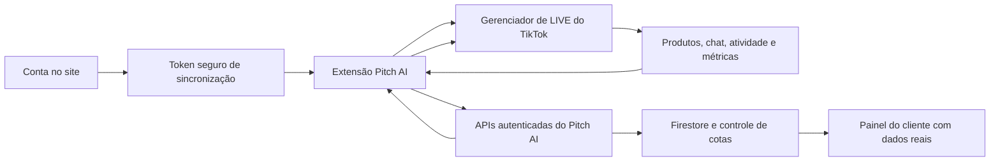

# Histórico de desenvolvimento — Pitch AI LIVE

> Registro consolidado das funcionalidades, correções, decisões técnicas, testes e publicações realizados nesta sequência de desenvolvimento.

**Atualizado em:** 15 de agosto de 2026
**Versão atual da aplicação e da extensão:** `0.16.3`
**Escopo:** site, painel do cliente, APIs, Firebase/Firestore, extensão Chrome e integração com o Gerenciador de LIVE do TikTok Shop.

## 1. Objetivo do produto

O Pitch AI LIVE foi evoluído para automatizar a operação de uma LIVE do TikTok Shop com o mínimo possível de intervenção do usuário. O fluxo desejado é:

1. O cliente cria ou acessa sua conta no site.
2. A extensão identifica automaticamente a conta e sincroniza o acesso com segurança.
3. Na página do TikTok Shop, a extensão localiza produtos, chat, campo de resposta, análises, atividade, avisos e controles da LIVE.
4. A IA responde o chat, fixa e desfixa os produtos selecionados, acompanha métricas e pedidos e pode iniciar ou encerrar a LIVE conforme a configuração.
5. O painel do cliente mostra somente informações reais recebidas da extensão.
6. Os recursos são limitados conforme o plano; ao atingir o limite, o cliente recebe um aviso e uma oferta de upgrade.



## 2. Controle de acesso, assinatura e tokens

Foi criada uma camada central de cotas por assinatura em `src/lib/live/quotas.ts`. Ela define os limites comerciais, normaliza nomes antigos de planos e permite que o administrador sobrescreva os valores no documento `admin_settings/plan_quotas`, sem precisar publicar uma nova versão.

### Limites padrão atuais

| Plano | Tokens por dia | Tokens por mês | Voz/TTS | Modelo permitido |
|---|---:|---:|---:|---|
| Gratuito | 0 | 0 | 0 min | Flash |
| Mensal | 500.000 | 5.000.000 | 0 min | Flash |
| Trimestral | 1.200.000 | 12.000.000 | 180 min | Flash e Pro |
| Anual | 3.000.000 | 30.000.000 | 600 min | Flash e Pro |

Também foram implementados:

- verificação da cota diária e mensal antes de executar IA;
- contabilização de tokens usados e restantes;
- bloqueio seguro quando a franquia chega ao limite;
- período e data de renovação da cota na resposta das APIs;
- tratamento separado para chat, geração de texto, transcrição e voz;
- bloqueio de voz em tempo real no plano Mensal;
- compatibilidade com nomes antigos dos planos;
- acesso de cortesia integrado à mesma validação, sem liberar recursos de forma insegura;
- configuração administrativa das cotas;
- status de conta ativa, cortesia, cota excedida ou bloqueada.

### Aviso e pitch de upgrade

Quando o limite é atingido, as APIs retornam o motivo `quota_exceeded`, o saldo, o período atingido e uma oferta de upgrade pronta para a interface:

- Mensal → recomendação do Trimestral, com 12 milhões de tokens/mês e voz em tempo real;
- Trimestral → recomendação do Anual, com 30 milhões de tokens/mês;
- demais casos → direcionamento para a página de planos.

O comportamento foi aplicado às APIs de resposta do chat, Gemini e TTS. A extensão recebe a mensagem de limite e pode exibir o CTA sem continuar consumindo tentativas.

## 3. Sincronização entre conta e extensão

O fluxo de sincronização foi remodelado para reduzir o erro de “Código inválido ou expirado” e evitar que o acesso de cortesia quebre a liberação.

Principais entregas:

- endpoint autenticado `POST /api/account/sync-token`;
- criação e recuperação segura do token vinculado ao usuário;
- ponte `extension/account-bridge.js` executada no site para detectar a extensão e enviar a configuração da conta;
- verificação pública do token em `/api/public/live/verify`;
- atualização de configuração por `/api/public/live/config`;
- proteção por rate limit nos endpoints públicos;
- validação no servidor de assinatura, cortesia, bloqueio e cota;
- exibição do status e da versão da extensão no painel;
- botão para gerar um novo token e reenviar a configuração atual;
- suporte a instalação limpa e atualização da extensão.

A extensão não recebe credenciais de provedor de IA. Ela usa o token da conta para chamar as APIs do Pitch AI, que mantêm as chaves e regras no servidor.

## 4. Leitura automática da página do TikTok

A dependência de “apontar” manualmente cada elemento foi reduzida com um sistema de descoberta automática dividido em setores:

- **PRODUTOS** — vitrine e lista de produtos da LIVE;
- **ESTÚDIO** — vídeo e controles da transmissão;
- **CHAT** — mensagens e campo de resposta;
- **ATIVIDADE** — entradas, pedidos e eventos;
- **ANÁLISE** — GMV, espectadores e demais indicadores;
- **AVISOS E BOTÕES DA LIVE** — violações, iniciar e encerrar.

O mapeamento usa textos visíveis, atributos acessíveis, estrutura da página, pontuação por contexto e caminhos conhecidos. Há cache, invalidação e recuperação automática quando o TikTok altera parte do DOM.

Durante a inspeção da página autenticada, foram confirmados rótulos reais como “Lista de produtos nesta LIVE”, “Chat”, “Digite algo...”, “Análise de transmissões ao vivo”, “Atividade” e “Iniciar LIVE”.

Os controles manuais de recuperação foram mantidos como último recurso para mudanças futuras do TikTok, mas não são necessários no fluxo normal.

## 5. Produtos e função “Fixar Produto”

A antiga nomenclatura “Rodízio de Produtos Fixados” foi substituída por **Fixar Produto**, deixando claro que a automação fixa e desfixa produtos na LIVE.

### Leitura da vitrine

- leitura por respostas de rede do TikTok e pelo DOM visível;
- catálogo inicial recuperado com tentativas limitadas;
- atualização acionada por mudança real da API ou pelo botão “Atualizar vitrine”;
- remoção da varredura completa em loop a cada cinco segundos;
- filtro de termos de interface, como “CARRINHO”, para que não virem produtos;
- preservação de produtos cadastrados manualmente;
- atualização profunda substitui o catálogo lido anteriormente sem apagar seleção e estado úteis.

### Correção de duplicados

Na `0.15.12`, a deduplicação passou a combinar:

- ID/SKU quando disponível;
- blocos retornados pela API;
- nome normalizado;
- comparação aproximada de nomes longos ou truncados pela interface.

Isso impede que o mesmo produto seja duplicado ou triplicado a cada atualização. Produtos realmente diferentes, mesmo quando possuem nomes parecidos, continuam separados.

### Fixar e desfixar

- o usuário escolhe uma vez quais produtos participam da automação;
- a extensão direciona o ciclo somente para os produtos selecionados;
- o clique é realizado no botão real de fixar/desfixar do TikTok;
- o estado é confirmado antes de avançar;
- o intervalo entre produtos aceita mínimo e máximo configuráveis;
- falhas são limitadas e registradas, evitando clique infinito ou tela piscando.

## 6. Respostas automáticas no chat

O fluxo de chat foi preparado para trabalhar sem depender de ação repetitiva do usuário:

1. A extensão observa novas mensagens reais do chat.
2. Eventos do sistema, entradas de usuários e textos que não são perguntas são filtrados.
3. Lista de bloqueio e palavras permitidas são verificadas antes de gastar tokens.
4. A mensagem é enviada de forma autenticada para `/api/public/chat/reply`.
5. A resposta é inserida no campo real “Digite algo...”.
6. A extensão dispara os eventos compatíveis com React e envia com Enter ou com o botão próximo ao editor.
7. A mensagem só é marcada como respondida depois que o campo confirma o envio.

A versão `0.15.12` acrescentou o mapeamento específico `chatReply`, setter nativo do campo, eventos `input/change`, envio por teclado e fallback por botão. O texto é limitado a 100 caracteres para respeitar o campo do TikTok.

No modo de revisão, a ação passou a indicar **Enviar e falar**, deixando explícito o que acontecerá. Foram incluídos retry com recuo, estado de conexão e prevenção de reprocessamento da mesma mensagem.

## 7. Iniciar, acompanhar e encerrar LIVE

Foram adicionados mapeamentos separados para os botões reais de iniciar e encerrar a transmissão.

Recursos implementados:

- localização automática do botão “Iniciar LIVE”;
- comando da extensão para clicar no controle real do TikTok;
- agendamento de início;
- detecção de LIVE ativa antes de iniciar o cronômetro;
- encerramento automático quando o tempo configurado é atingido;
- localização do botão textual de encerramento;
- fallback pelo ícone de energia e relógio da transmissão;
- confirmação do diálogo de encerramento;
- contagem regressiva e possibilidade de cancelar;
- número máximo de tentativas para evitar loops agressivos.

A seção de estúdio foi esclarecida: câmera, tela ou vídeo local servem como prévia da extensão e não substituem a transmissão do TikTok. Os botões de ação real atuam no Gerenciador de LIVE.

## 8. Avisos, violações e proteção

O sistema monitora alertas e pode pausar a IA para evitar que a automação continue durante um possível problema de conformidade.

Além da descoberta textual, foi incluído suporte ao controle de violação que não possui rótulo acessível até receber hover. O caminho estrutural informado e validado foi incorporado ao mapa:

```text
/html/body/div[2]/div/div[2]/main/div/div/div/div/div/div/div[1]/div/div[2]/span/button
```

Os eventos de violação são enviados para a sessão, incrementam `violation_count` e aparecem no acompanhamento real. O botão **Proteção** controla a pausa geral da IA em vez de ser apenas decorativo.

## 9. Pedidos e atividade

A região **Atividade** passou a ser observada desde o início, mesmo quando está vazia. Antes, a observação podia terminar antes do primeiro pedido e a venda nunca chegava ao painel.

Na `0.15.11`:

- o observador deixou de expirar após 60 segundos;
- novos elementos da atividade são analisados continuamente;
- somente evidências de venda/pedido são contabilizadas;
- entradas de usuário e eventos comuns não viram pedidos;
- cada evento é deduplicado antes de ser enviado ao backend.

## 10. Métricas reais no painel do cliente

Os valores fictícios foram removidos do painel de automações. A extensão agora lê e envia, quando disponíveis:

- GMV atribuído;
- itens atribuídos vendidos;
- espectadores atuais;
- duração média de visualização;
- cliques no produto;
- porcentagem de visitantes;
- pedidos reais;
- mensagens respondidas e demais eventos da sessão.

O endpoint `/api/public/live/session` aceita eventos `metrics` e `violation`. As métricas ficam em `live_metrics`, com horário de captura, e são atualizadas parcialmente para que uma atualização não sobrescreva pedidos ou contadores concorrentes.

O painel `AiAutomationsDashboard.tsx` passou a consultar sessões reais, atualizar aproximadamente a cada oito segundos e mostrar `—` quando um valor não foi detectado. Sessões de demonstração e registros históricos artificiais não são usados como dados do cliente.

## 11. Demo, tutorial e experiência do usuário

Foram feitas melhorias para tornar o produto utilizável por uma pessoa leiga:

- animação de primeiro uso em tela cheia;
- tutorial guiado sobre instalação, sincronização e recursos;
- demo claramente identificada;
- eventos de demonstração não contaminam as métricas reais;
- textos mais diretos e explicações curtas;
- reorganização das abas da sidebar;
- correção do menu “... Mais” que ficava escondido;
- largura da extensão ampliada e comportamento responsivo;
- linhas de produto, botões e textos com quebra adequada;
- barra superior com Proteção, Ouvir, Produtos, Demo, Painel e Nova aba;
- redução de mensagens repetidas de “conectado ao plano”.

## 12. Login, cadastro e página pública

Foram revisados o acesso e a navegação da landing page:

- correções no login com Google;
- garantia de criação/recuperação da conta autenticada;
- botão **Começar grátis** direcionado diretamente à criação de conta;
- navegação pública separando “Entrar” de “Começar grátis”;
- melhorias visuais e responsivas da landing page;
- componentes novos para navegação, demonstrações e explicação em etapas.

Arquivos relacionados incluem `src/routes/entrar.tsx`, `src/routes/index.tsx`, `src/components/live/LandingNav.tsx`, `FeatureDemos.tsx`, `StepPhone.tsx` e `src/styles/landing.css`.

## 13. Evolução das versões

| Versão | Principais mudanças |
|---|---|
| `0.15.1` | Estado inicial mostrado nos primeiros relatos: sincronização inválida e recursos ainda dependentes de apontamento. |
| `0.15.5` | Versão antiga encontrada instalada durante a inspeção autenticada; não contém as correções mais recentes. |
| `0.15.9` | Evolução de produtos, chat no backend, voz/Gemini, fixar/desfixar e temporizador de LIVE. |
| `0.15.10` | Pipeline de métricas reais e remoção do painel com dados fictícios. |
| `0.15.11` | Correção da captura do primeiro pedido e observação contínua de Atividade. |
| `0.15.12` | Deduplicação da vitrine, botão de violações, escrita/envio real no chat, controles reais de estúdio/LIVE e melhor distribuição da sidebar. |

## 14. APIs principais

| Endpoint | Finalidade |
|---|---|
| `/api/account/sync-token` | Criar ou recuperar o token de sincronização da conta autenticada. |
| `/api/public/live/verify` | Validar token, assinatura, cortesia, bloqueio e cotas. |
| `/api/public/live/config` | Ler e sincronizar a configuração da extensão. |
| `/api/public/live/mapping` | Salvar/recuperar mapas de elementos e diagnóstico. |
| `/api/public/live/session` | Criar sessão e registrar respostas, produtos, vendas, métricas e violações. |
| `/api/public/chat/reply` | Gerar resposta de chat com autenticação, filtros e contabilização de tokens. |
| `/api/public/gemini/generate` | Gerar texto com limite de entrada e cota do plano. |
| `/api/public/gemini/transcribe` | Transcrever áudio com validação de tamanho, plano e cota. |
| `/api/public/tts/speak` | Gerar voz apenas para planos autorizados e dentro da franquia. |

## 15. Arquivos centrais alterados ou criados

| Área | Arquivos principais |
|---|---|
| Extensão e automação | `extension/content.js`, `regions.js`, `dom-map.js`, `hook.js`, `net-bridge.js` |
| Painel da extensão | `extension/panel.html`, `panel.js`, `panel.css`, `styles.css` |
| Ponte com a conta | `extension/account-bridge.js`, `src/routes/api/account/sync-token.ts` |
| Cotas e autenticação | `src/lib/live/quotas.ts`, `api-auth.server.ts`, `admin.ts` |
| Sessões e métricas | `src/routes/api/public/live/session.ts`, `src/lib/live/sync.ts` |
| Dashboard real | `src/components/live/AiAutomationsDashboard.tsx` |
| Conta e status | `SyncTokenCard.tsx`, `ExtensionStatusBanner.tsx`, `AdminUsuariosTab.tsx` |
| Login e landing | `src/routes/entrar.tsx`, `index.tsx`, `planos.tsx`, `LandingNav.tsx` |
| Empacotamento | `scripts/pack-extension.mjs`, `public/pitchai-extension.zip` |
| Segurança de dados | `firestore.rules`, `src/lib/firebase.server.ts` |
| Stripe e checkout | `src/lib/stripe.server.ts`, `stripe.ts`, `live/plans.ts`, `api/checkout/start.ts` |
| Webhook de assinatura | `src/routes/api/public/payments/webhook.ts`, `checkout.return.tsx` |
| Administração financeira | `src/lib/live/admin.ts`, `src/routes/admin.tsx` |
| Layout do cliente | `src/components/live/LiveDashboard/index.tsx`, `SyncTokenCard.tsx` |

## 16. Empacotamento da extensão

O script `scripts/pack-extension.mjs` gera `public/pitchai-extension.zip` com os arquivos do manifesto. O empacotamento passou a:

- copiar os arquivos de forma binária segura;
- validar a integridade do PNG e do ZIP;
- conferir arquivos obrigatórios;
- impedir referências proibidas ao backend legado;
- publicar a mesma versão indicada pelo site e pelo manifesto.

Comandos usuais:

```bash
npm run build:extension
npm run build
```

## 17. Publicações na Vercel

Ambiente principal atual:

- site: <https://pitchai-hm.vercel.app>
- download da extensão: <https://pitchai-hm.vercel.app/pitchai-extension.zip>
- alias alternativo: <https://pitchai-moon-e5ad.vercel.app>
- alias antigo preservado: <https://pitchai-git-fix-frontend-usuario-lp-moon-e5ad.vercel.app/>

O fluxo utilizado para evitar sobrescrever o alias antigo foi:

```bash
npm run build:extension
npm run build
npx vercel deploy --prebuilt --yes --scope moon-e5ad
# validar o preview e, somente depois:
npx vercel promote URL_DO_PREVIEW --scope moon-e5ad --yes
```

Publicação da extensão `0.15.12`:

- versão: `0.15.12`;
- deployment: `dpl_DMhBbQ8h8synxPPT8VgjDbTk9qMf`;
- preview: <https://pitchai-btlepw3zc-moon-e5ad.vercel.app>;
- ZIP publicado: 125.642 bytes.

Publicação mais recente do site e painel:

- preview validado: <https://pitchai-dkmzra1d5-moon-e5ad.vercel.app>;
- deployment do preview: `dpl_3t46sCkwvM6hmQE7FKyd7YfiG8yH`;
- promoção para produção: `2DDo58jfVyqsTLAEopv3iUZAo5YH`;
- produção: <https://pitchai-hm.vercel.app>;
- rota `/app` verificada com HTTP 200.

## 18. Validações realizadas

Foram executadas as seguintes verificações durante o desenvolvimento:

- testes automatizados da extensão: 4 de 4 passando;
- build TypeScript/JavaScript da extensão concluído;
- `node --check` nos arquivos gerados principais;
- build de produção do site concluído;
- validação manual da deduplicação de nomes truncados;
- produtos semelhantes, mas diferentes, mantidos separados;
- verificação HTTP 200 do site e do ZIP;
- inspeção autenticada da interface real do TikTok Shop;
- conferência de versão entre site, manifesto, painel e pacote.
- criação e consulta dos produtos/preços na API Stripe;
- webhook Stripe verificado como `enabled`;
- checkout sem login verificado com resposta 401;
- webhook sem assinatura verificado com resposta 400;
- consulta real de assinaturas, faturas e saldo Stripe;
- remoção do bloco “Novidades” confirmada no bundle de produção;
- layout do cliente revisado em preview e build responsivo;
- todos os builds de produção posteriores à migração Stripe concluídos sem erro.

## 19. Pontos que ainda exigem teste em uma LIVE real

Os itens abaixo foram implementados e validados por código, build e inspeção da página, mas precisam de um teste operacional com a versão `0.15.12` instalada e uma LIVE ativa:

- leitura dinâmica de GMV, espectadores, cliques e pedidos enquanto os valores mudam;
- recebimento do primeiro pedido real e atualização do painel;
- resposta automática completa: capturar pergunta, gerar IA, preencher e enviar;
- fixar e desfixar cada produto selecionado;
- abertura do alerta real de violação e pausa da proteção;
- localização do botão de encerrar, que só aparece durante a transmissão;
- encerramento automático quando o tempo configurado é atingido;
- confirmação visual de que as métricas da extensão aparecem no painel do cliente.

### Roteiro recomendado de homologação

1. Remover a extensão antiga (`0.15.5` ou anterior).
2. Baixar e instalar o ZIP `0.15.12` publicado.
3. Entrar no site e confirmar que a conta aparece como autenticada.
4. Abrir o Gerenciador de LIVE do TikTok e aguardar a detecção automática.
5. Atualizar a vitrine duas ou três vezes e conferir que não surgem duplicados.
6. Selecionar dois produtos e testar fixar/desfixar.
7. Enviar uma pergunta por outra conta e observar a resposta automática.
8. Iniciar uma LIVE de teste com tempo curto e confirmar o encerramento.
9. Comparar GMV, espectadores e pedidos do TikTok com o painel Pitch AI.
10. Registrar captura e horário de qualquer divergência para localizar o seletor ou evento exato.

## 20. Resultado atual

O projeto saiu de uma extensão com sincronização instável, dependência de apontamento manual, ciclos agressivos e painel fictício para uma arquitetura autenticada e orientada por eventos. A versão atual possui descoberta automática, catálogo deduplicado, seleção de produtos, resposta de chat, controles de LIVE, métricas reais, proteção por plano e uma experiência mais simples para o usuário final.

O principal próximo passo não é criar outra camada de automação, e sim homologar a `0.15.12` em uma LIVE real para ajustar somente os elementos que o TikTok apresenta durante a transmissão ativa.

## 21. Migração de pagamentos para Stripe

Em 15 de agosto de 2026, o checkout principal foi migrado da PerfectPay para o Stripe direto:

- plugin `stripe@openai-curated` instalado e habilitado;
- cliente servidor deixou de depender do gateway intermediário do Lovable;
- chaves passaram a usar `VITE_STRIPE_PUBLISHABLE_KEY`, `STRIPE_SECRET_KEY` e `STRIPE_WEBHOOK_SECRET`;
- segredos configurados na Vercel e mantidos fora do Git;
- produtos e preços recorrentes criados para Mensal, Trimestral e Anual;
- `/api/checkout/start` passou a criar cliente e Checkout Session hospedada no Stripe;
- retorno configurado em `/checkout/return` e cancelamento em `/planos`;
- webhook criado em `/api/public/payments/webhook`;
- criação, atualização e cancelamento de assinatura sincronizam automaticamente o acesso no Firestore;
- plano exato comprado passou a ser preservado para aplicação correta das cotas;
- textos públicos e tela de bloqueio foram atualizados para Stripe;
- build de produção e smoke tests concluídos;
- deployment promovido para <https://pitchai-hm.vercel.app>.

O ambiente atual usa chaves `pk_test_`/`sk_test_`, portanto está em **modo de teste**. Para cobrar clientes reais será necessário substituir as chaves pelas versões `pk_live_`/`sk_live_`, criar os preços equivalentes na conta LIVE e cadastrar um novo webhook LIVE.

## 22. Plano temporário de homologação por R$ 1

Foi criado no Stripe um plano recorrente de R$ 1,00 a cada três meses para testar o fluxo de ponta a ponta como se fosse o Trimestral.

Durante a homologação:

- o `lookup_key` usado foi `pitchai_trimestral_teste_1real`;
- o plano apareceu temporariamente na página pública;
- o checkout foi processado pelo Stripe em modo de teste;
- o webhook converteu o plano de teste para `pitchai_trimestral`;
- voz, IA e limites foram concedidos como no Trimestral;
- a disposição pública de planos foi adaptada para quatro cards durante o teste.

Depois da confirmação do fluxo:

- o plano foi removido da página pública;
- o preço foi desativado no Stripe;
- o produto foi arquivado;
- novos checkouts diretos foram bloqueados pela consulta de preços ativos;
- a compatibilidade interna foi preservada para não quebrar assinatura ou webhook de quem participou do teste;
- a página pública voltou ao grid de três planos comerciais.

## 23. Administração integrada ao Stripe

A aba **Planos & receita** do painel administrativo deixou de depender somente da projeção armazenada no Firestore e passou a consultar a conta Stripe diretamente.

### Indicadores adicionados

- ambiente atual: teste ou produção;
- MRR calculado pelas recorrências reais;
- total recebido nos últimos 30 dias;
- saldo disponível;
- saldo pendente;
- assinaturas ativas;
- assinaturas em período de teste;
- cobranças `past_due`, `unpaid` ou `incomplete`;
- assinaturas canceladas;
- quantidade de assinaturas Stripe não sincronizadas no Firestore.

### Operação de assinaturas

O admin agora recebe uma tabela com:

- e-mail do cliente;
- ID da assinatura;
- plano pelo `lookup_key`;
- valor do ciclo;
- status Stripe;
- indicação de cancelamento no fim do período;
- próxima renovação;
- estado de sincronização com o Firestore;
- link direto para abrir a assinatura no Dashboard Stripe.

Também foi incluída uma lista de faturas recentes com valor, status e link para a fatura hospedada. A consulta é atualizada automaticamente a cada 30 segundos e possui atualização manual.

### Reconciliação Stripe × Firestore

O Stripe é tratado como fonte financeira real. O Firestore continua sendo a fonte de autorização rápida da aplicação e da extensão. O painel compara `stripe_subscription_id` dos dois lados e alerta quando uma assinatura ativa não está sincronizada, permitindo identificar falha de webhook sem liberar acesso manualmente por engano.

As projeções antigas do Firestore continuam visíveis abaixo da visão Stripe, claramente rotuladas como **Projeção interna do Firestore**.

### Segurança

- toda consulta Stripe é executada no servidor;
- a função exige token Firebase válido;
- o usuário autenticado precisa passar por `ensureAdmin`;
- a chave secreta nunca é enviada ao navegador;
- valores sensíveis ficam em variáveis da Vercel e em `.env.local`, ignorado pelo Git;
- os links do admin apontam para o ambiente correto do Dashboard Stripe (`test` ou `live`).

## 24. Reformulação do layout do painel do cliente

O painel autenticado foi ajustado após relatos de texto vazando, conteúdo excessivamente centralizado e aparência de layout mobile em telas grandes.

Mudanças realizadas:

- remoção completa do card **Novidades**;
- remoção dos avisos “MVP público lançado” e “Em breve — Login + Planos”;
- largura máxima do painel ampliada de 1152 px para 1600 px;
- cabeçalho, conteúdo e rodapé passaram a compartilhar a nova largura;
- coluna principal configurada como `minmax(0, 1fr)` para crescer dinamicamente;
- sidebar passou a usar faixa responsiva entre 340 e 390 px;
- espaçamento ampliado em desktop sem prejudicar celular e tablet;
- rodapé deixou de parecer isolado no centro;
- `overflow-x-clip` aplicado na página para conter vazamentos residuais;
- card de sincronização recebeu `min-width: 0` e `overflow: hidden`;
- e-mail longo pode quebrar sem empurrar plano ou botão de sair;
- selo do plano pode mudar de linha;
- valores de cotas usam grid com coluna numérica estável;
- token usa campo flexível e botão de copiar com largura fixa;
- botão de sair e demais ações críticas não encolhem indevidamente.

O comportamento final mantém uma coluna única em telas pequenas e muda para conteúdo amplo com sidebar somente quando há espaço real de desktop.

## 25. Estado consolidado do projeto

No estado atual, o Pitch AI reúne quatro sistemas conectados:

1. **Site e autenticação** — cadastro, Google Login, planos, checkout e painel do cliente.
2. **Extensão Chrome** — leitura e automação do Gerenciador de LIVE do TikTok Shop.
3. **Backend e Firestore** — sincronização, configuração, sessões, métricas, cotas e autorização.
4. **Stripe** — checkout, assinatura recorrente, webhook, faturamento e visão financeira administrativa.

As principais pendências deixaram de ser estruturais. O trabalho restante concentra-se em homologar ações dependentes de uma LIVE real, trocar o Stripe de teste para LIVE quando a operação comercial estiver pronta e acompanhar divergências apontadas pelo novo painel administrativo.
